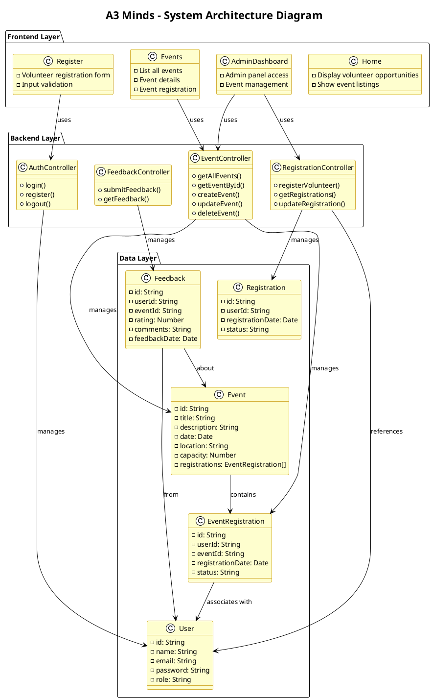

# A3 Minds - Project Report

## Overview
This report documents the A3 Minds volunteer management system, including its architecture, use cases, and system design.

---

## 1. Use Case Diagram

The following diagram illustrates the main use cases for both public users and administrators.

```puml
@startuml A3_Minds_Use_Case_Diagram

!theme plain
skinparam actorStyle awesome
skinparam useCaseStyle rectangle

title A3 Minds - Use Case Diagram

' Actors
actor "Public User" as PublicUser
actor "Admin" as Admin
actor "System" as System

' Package: Public Website
package "Public Website" {
  usecase "View Home Page" as UC1
  usecase "View About Page" as UC2
  usecase "View Vision & Mission" as UC3
  usecase "View Events & Activities" as UC4
  usecase "Register as Volunteer" as UC5
  usecase "Contact Organization" as UC6
  usecase "View Event Details" as UC7
}

' Package: Admin Dashboard
package "Admin Dashboard" {
  usecase "Admin Login" as UC8
  usecase "Admin Logout" as UC9
  usecase "View Event Management Dashboard" as UC10
  usecase "Create New Event" as UC11
  usecase "View All Events" as UC12
  usecase "Edit Event" as UC13
  usecase "Delete Event" as UC14
  usecase "View Event Details" as UC15
}

' Package: System
package "System" {
  usecase "Authenticate Admin" as UC16
  usecase "Store Event Data" as UC17
  usecase "Retrieve Event Data" as UC18
  usecase "Update Event Data" as UC19
  usecase "Delete Event Data" as UC20
  usecase "Validate Event Data" as UC21
}

' Public User relationships
PublicUser --> UC1
PublicUser --> UC2
PublicUser --> UC3
PublicUser --> UC4
PublicUser --> UC5
PublicUser --> UC6
PublicUser --> UC7

' Admin relationships
Admin --> UC8
Admin --> UC9
Admin --> UC10
Admin --> UC11
Admin --> UC12
Admin --> UC13
Admin --> UC14
Admin --> UC15

' System relationships
UC8 ..> UC16 : include
UC11 ..> UC17 : include
UC11 ..> UC21 : include
UC12 ..> UC18 : include
UC13 ..> UC19 : include
UC13 ..> UC21 : include
UC14 ..> UC20 : include

@enduml
```

---

## 2. System Architecture Diagram

The following diagram shows the layered architecture of the A3 Minds system.

---

## 3. Key Components

### Frontend Layer
- **Home**: Landing page showcasing volunteer opportunities
- **Events**: Event listing and details page
- **Register**: Volunteer registration form
- **AdminDashboard**: Admin control panel for event management

### Backend Layer
- **AuthController**: Handles user authentication and authorization
- **EventController**: Manages CRUD operations for events
- **RegistrationController**: Manages volunteer registrations
- **FeedbackController**: Handles feedback submissions

### Data Layer
- **User**: Stores user profile information
- **Event**: Stores event details and metadata
- **EventRegistration**: Links users to events
- **Feedback**: Stores user feedback and ratings
- **Registration**: Manages general registration records

---

## Conclusion

The A3 Minds system is designed with a clean three-layer architecture, separating concerns between presentation, business logic, and data storage. This structure ensures scalability, maintainability, and ease of future enhancements.
